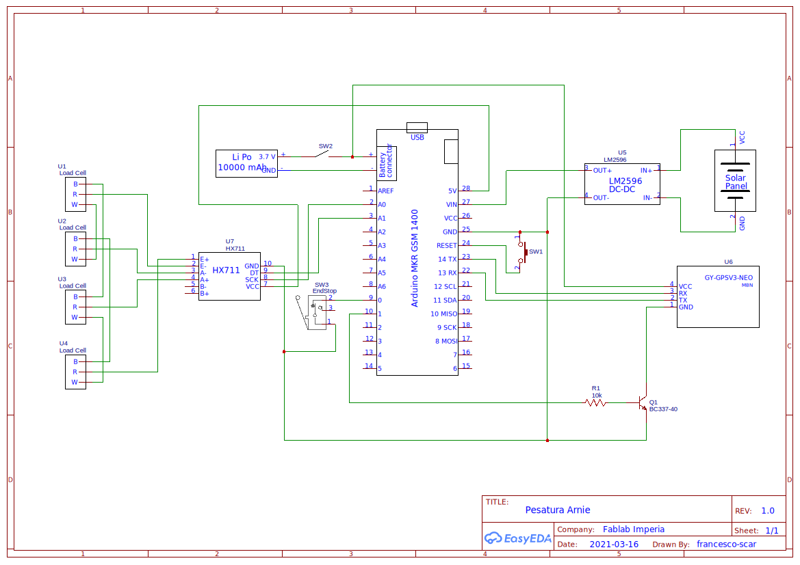

Pesatura Arnie
==============

Scopo di questo progetto è la realizzazione di un semplice sistema per la pesatura e il monitoraggio di Arnie.
Il sistema controlla il peso di un'arnia mediante bilancia a celle di carico, consente un monitoraggio continuo appoggiandosi ad una piattaforma Web e avvisa mediante notifica in caso di anomalia (peso troppo basso, batteria al minimo).

Il sistema funziona mediante batteria e GPRS ed è basato sulla scheda Arduino MKR GSM 1400.

# Sommario
- [Componenti](#Componenti)
- [Schema e Montaggio](#Schema-e-Montaggio)
    - [Schema](#Schema)
    - [Descrizione componenti](#Descrizione-componenti)
- [Installazione software](#Installazione-software)

# Componenti
- [Arduino MKR GSM 1400](https://store.arduino.cc/arduino-mkr-gsm-1400-1415) e relativa antenna
- Bilancia pesapersone (in alternativa 4 [celle di carico](https://it.wikipedia.org/wiki/Cella_di_carico) da 50kg a 3 fili*)
- ADC HX711 per celle di carico
- Convertitore step down variabile LM2596
- Batteria Lipo 10000mAh
- Ricevitore [GPS ublox NEO-M8N](https://www.u-blox.com/en/product/neo-m8-series)
- Pannello fotovoltaico
- SIM con contratto attivo
- Interruttore (per alimentatore)
- 2 pulsanti (un finecorsa e un pulsante per il reset)
- Transistor NPN (ad esempio BC337-40)
- Resistenza 10kΩ
- Jumper e/o cavi di collegamento

*le celle di carico devono essere tutte e 4 dello stesso tipo, si consiglia di acquistarle insieme dallo stesso venditore

# Schema e Montaggio

## Schema
**ATTENZIONE**: il convertitore di tensione deve essere regolato tra 5V e 6V (come da [specifiche della scheda](DOC/ABX00018_MKR GSM 1400.pdf)) **PRIMA** di essere collegato alla scheda, perché potrebbe essere regolato a tensioni maggiori. Tensioni superiori possono danneggiare irreversibilmente la scheda Arduino. Collegare quindi prima il pannello solare al regolatore di tensione, esporre il pannello al sole e regolare la tensione in uscita tra 5V e 6V usando un multimetro, ruotando il potenziometro sulla scheda (solitamente è di colore blu con un piccolo albero di metallo con testa a taglio in un angolo) fino al raggiungimento del valore desiderato.

# Installazione software
