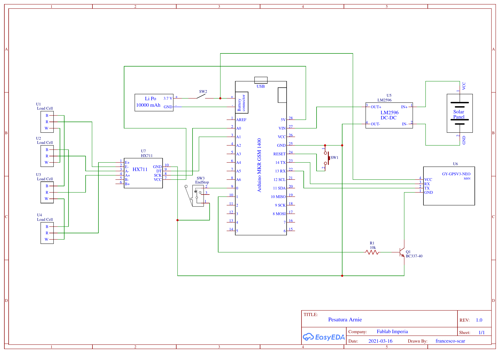
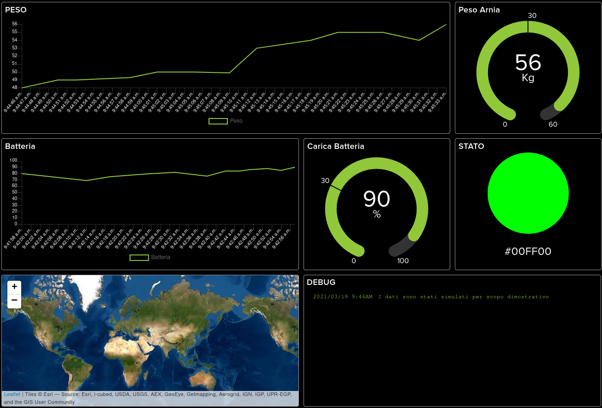

Pesatura Arnie
==============

Scopo di questo progetto è la realizzazione di un semplice sistema per la pesatura e il monitoraggio di Arnie.
Il sistema controlla il peso di un'arnia mediante bilancia a celle di carico, consente un monitoraggio continuo appoggiandosi ad una piattaforma Web e avvisa mediante notifica in caso di anomalia (peso troppo basso, batteria al minimo).

Il sistema funziona mediante batteria e GPRS ed è basato sulla scheda Arduino MKR GSM 1400.

# Sommario
- [Componenti](#Componenti)
- [Schema e Montaggio](#Schema-e-Montaggio)
    - [Schema](#Schema)
    - [Descrizione componenti](#Descrizione-componenti)
- [Configurazione](#Configurazione)
    - [SIM](#SIM)
    - [Telegram](#Telegram)
    - [Adafruit MQTT broker](#Adafruit-MQTT-broker)
- [Installazione](#Installazione)
    - [Installazione scheda](#Installazione-scheda)
    - [Librerie](#Librerie)
    - [Caricare programma Arduino](#Caricare-programma-Arduino)

# Componenti
- [Arduino MKR GSM 1400](https://store.arduino.cc/arduino-mkr-gsm-1400-1415) e relativa antenna
- Bilancia pesapersone (in alternativa 4 [celle di carico](https://it.wikipedia.org/wiki/Cella_di_carico) da 50kg a 3 fili*)
- ADC HX711 per celle di carico
- Convertitore step down variabile LM2596
- Batteria Lipo 10000mAh
- Ricevitore [GPS ublox NEO-M8N](https://www.u-blox.com/en/product/neo-m8-series)
- Pannello fotovoltaico
- SIM con contratto attivo
- Interruttore (per alimentatore)
- 2 pulsanti (un finecorsa e un pulsante per il reset)
- Transistor NPN (ad esempio BC337-40)
- Resistenza 10kΩ
- Jumper e/o cavi di collegamento

*le celle di carico devono essere tutte e 4 dello stesso tipo, si consiglia di acquistarle insieme dallo stesso venditore

# Schema e Montaggio

## Schema
**ATTENZIONE**: il convertitore di tensione deve essere regolato tra 5V e 6V (come da [specifiche della scheda](DOC/ABX00018_MKR%20GSM%201400.pdf)) **PRIMA** di essere collegato alla scheda, perché potrebbe essere regolato a tensioni maggiori. Tensioni superiori possono danneggiare irreversibilmente la scheda Arduino. Collegare quindi prima il pannello solare al regolatore di tensione, esporre il pannello al sole e regolare la tensione in uscita tra 5V e 6V usando un multimetro, ruotando il potenziometro sulla scheda (solitamente è di colore blu con un piccolo albero di metallo con testa a taglio in un angolo) fino al raggiungimento del valore desiderato.

## Descrizione componenti
- #### Celle di carico 
    Come indicato in [questo schema](images/schema_bilancia_api.png) i colori (bianco - W, rosso - R, nero - B) dei fili dei singoli sensori di carico possono variare a seconda del produttore, è quindi consigliato controllare con un multimetro la coppia di fili tra cui si ha la maggiore resistenza, essi saranno il + e il - (solitamente sono il bianco e il nero, come mostrato nello schema). Invertendo la polarità di questi due fili i sensori non si danneggeranno, ma la scheda potrebbe misurare variazioni di peso negative, in tal caso invertire questi due fili per tutti i sensori.
- #### HX711
    Questo modulo per celle di carico contenente un ADC sigma-delta a 24 bit che permette di compiere misure con maggiore precisione rispetto l'ADC interno della scheda MKR GSM 1400 (ADC a 8, 10 o 12 bit). Il valore letto viene trasmesso in seriale alla scheda.
- #### Interruttori e pulsanti
    - **SW1** è un pulsante usato per il reset della scheda, utile perché quello presente sulla scheda non è accessibile una volta chiusa ermeticamente la struttura.
    - **SW2** interrompe l'alimentazione dalla batteria, ma la scheda rimane comunque alimentata dal pannello solare se collegato e illuminato.
    - **SW3** è un finecorsa normalmente chiuso posizionato sulla base in modo che sia premuto (contatto aperto) quando l'arnia e appoggiata e sia rilasciato (contatto chiuso) quando viene sollevata; è usato come sensore per l'attivazione dei messaggi di allarme.
- #### LM2596 e pannello solare
    Il convertitore di tensione deve essere regolato tra 5V e 6V come spiegato in precedenza. Si consiglia di collegare il pannello solare al regolatore di tensione mediante un connettore, in modo che sia semplice scollegarlo durante il trasporto o per altri motivi.
- #### GPS, transistor e resistenza
    Il modulo GPS fornisce in protocollo UART i dati di posizione calcolati, la precisione è indicativamente di decine di metri, ma varia significativamente in base al numero di satelliti visibili. Per ridurre il consumo del modulo quando non viene utilizzato (l'utilizzo effettivo è di solo qualche minuto al giorno in condizioni normali) l'alimentazione viene interrotta da un transistor BJT quando non è necessario. Il dimensionamento della resistenza è tale da garantire il funzionamento in saturazione/interdizione (funzionamento come interruttore on/off)
- #### Batteria
    La capacità della batteria è stata scelta per garantire il funzionamento con contiua trasmissione per approssimativamente un paio di giorni. L'autonomia effettiva è molto maggiore perché per la maggior parte del tempo la scheda riduce i consumi limitando le attività svolte; in aggiunta il pannello solare, se esposto al sole per qualche ora al giorno, è sufficiente per conpensare l'energia consumata durante la notte.

    

# Configurazione

## SIM
Si consiglia una SIM IoT a consumo (ad esempio noi abbiamo utilizzato un SIM [ThingsMobile](https://www.thingsmobile.com/business/plans/overview)) che, con un consumo di pochi MB/mese, avrà un costo indicativo di circa 10 €/anno per un funzionamento normale e continuativo.

Per semplicità, ed evitare problemi con il blocco della SIM, si consiglia di rimuovere il PIN dalla SIM inserendola in un telefono cellulare e cercando questa opzione tra le impostazioni del telefono (in alternativa si possono impostare le credenziali nell'apposita sezione del file `secrets.h`, ma questa funzionalità non è stata testata)

In base all'operatore scelto è necessario configurare l'APN dalla [riga 33](https://github.com/fablab-imperia/PesaturaArnie/blob/340e1f83699dbf9c792564b57609034c4c4d1c3a/PesaturaArnie.ino#L33) dove sono già indicati alcuni tra i più diffusi. È sufficiente commentare (con `//` davanti alla riga) tutti gli APN tranne quello desiderato.

## Telegram
Per ricevere le notifiche con messaggi Telegram è necessatio creare un [BOT Telegram](https://core.telegram.org/bots).
- Bisogna attivare un bot chiamato [BotFather](https://t.me/botfather) (cercare BotFather dalla ricerca Telegram oppure aprire il link precedente da un dispositivo con Telegram installato)
- Seguire le istruzioni per la creazione del BOT (`/newbot`, Scegli un nome,  Scegli uno username che termini con 'bot')
- (1) Nel messaggio finale BotFather invierà un token univoco per il bot, nella forma `123456:ABC-DEF1234ghIkl-zyx57W2v1u123ew11`
- Nell'implementazione attuale le notifiche vengono mandate ad un solo contatto/gruppo, quindi se si vuole che più persone ricevano le notifiche è necessario creare un gruppo con i partecipanti desiderati (tra cui il BOT stesso) e inviare il messaggio `/start` nella chat (per identificare con semplicità l'ID della chat); se invece è sufficiente un solo contatto attivare il BOT dall'account desiderato, aprendo il link inviato da BotFather nell'ultimo messaggio (nella forma di `t.me/username_bot`) e premere il pulsante `START` nella chat che si apre
- Aprire un browser (ad esempio Firefox) e digitare nella barra di ricerca `https://api.telegram.org/bot<token>/getUpdates`, sostituendo `<TOKEN>` con il token del BOT appena creato; la richiesta avrà quindi la forma di `https://api.telegram.org/bot123456:ABC-DEF1234ghIkl-zyx57W2v1u123ew11/getUpdates`
- (2) Il risultato della richiesta è in formato JSON e verrà formattato opportunamente da molti browser. L'ID della chat si trova seguendo il percorso `result > N > chat > id` dove `N` è il maggiore tra i numeri presenti (l'ultimo messaggio). L'ID è un numero intero positivo di 9 cifre nel caso di chat semplici e un numero intero negativo di 9 o 13 cifre nel caso di chat di gruppo
- Per verificare il corretto funzionamento digitare nella barra di ricerca del browser `https://api.telegram.org/bot<TOKEN>/sendMessage?chat_id=<CHAT_ID>&text=Test`, sostituendo `<TOKEN>` con il token trovato al punto (1) e `<CHAT_ID>` con l'ID trovato al punto (2); la richiesta avrà quindi la forma di `https://api.telegram.org/bot123456:ABC-DEF1234ghIkl-zyx57W2v1u123ew11/sendMessage?chat_id=123456789&text=Test`
- Se (dopo aver inviato la richiesta) viene inviato dal BOT un messaggio con il testo `Test` nella chat desiderata si può procedere ai passaggi successivi, altrimenti ricontrollare i passaggi precedenti (se nella pagina del browser la risposta alla richiesta è `Bad Request: chat not found`, l'ID della chat non è corretto; se la risposta è `Unauthorized` il token utilizzato non è valido, in tal caso controllare il token corretto tramite BotFather)

Nel file `secrets.h` sostuire il token di default alla [riga 12](https://github.com/fablab-imperia/PesaturaArnie/blob/47c2bf231c2096f7186dacecbd2dd199e71303bc/secrets.h#L12) con quello ricavato al punto (1)

Sempre nel file `secrets.h` sostuire l'ID della chat di default a cui inviare i messaggi alla [riga 11](https://github.com/fablab-imperia/PesaturaArnie/blob/47c2bf231c2096f7186dacecbd2dd199e71303bc/secrets.h#L11) con l'ID trovato al punto (2)

## Adafruit MQTT broker
Per mostrare graficamente l'andamento di peso e carica della batteria nell'ultimo mese, oltre che la posizione dell'arnia sulla mappa e un colore che permette di monitorare rapidamente lo stato dell'arnia è necessario registrare un account su [adafruit.io](https://accounts.adafruit.com/users/sign_up) oppure effettuare il [log in](https://accounts.adafruit.com/users/sign_in) se si è già registrati.

- Dal menu `Feeds`, con il pulsante `+New Feed` creare i seguenti feeds (volendo i nomi possono essere cambiati, ma devono coincidere con il codice):
    - Batteria
    - Debug
    - Peso
    - Posizione
    - Stato
- Dal menu `Dashboards`, con il pulsante `+New Dashboard` creare una nuova dashboard e aggiungere i seguenti blocchi dalla rotella delle impostazioni in alto a destra > Create New Block:
    - `Line chart` con feed `Peso`
    - `Line chart` con feed `Batteria`
    - `Gauge` con feed `Peso`
    - `Gauge` con fedd `Batteria`
    - `Color Picker` con feed `Stato`
    - `Map` con feed `Posizione`
    - `Stream` con feed `Debug`
- Regolare le impostazioni di ogni blocco secondo le proprie preferenze (ad esempio tipo di mappa, range e scale dei grafici, durata storico da visualizzare)

Il risultato finale dovrebbe essere simile a questo:

    

# Installazione

## Installazione scheda
Selezionare la scheda `Arduino MKR GSM 1400` dal menu `Toos > Board` oppure `Strumenti > Scheda`

Se è la prima volta che si programma la scheda MKR GSM 1400 è probabile che essa non sia presente nella lista delle schede disponibili, in tal caso è necessario aggiungerla:
- Aprire il gestore schede `Toos > Board > Boards Manager` oppure `Strumenti > Scheda > Gestore Schede`
- Cercare `Arduino MKR GSM 1400`
- **Selezionare la versione 1.6.21**
- Installare con l'apposito pulsante le schede `Arduino SAMD boards (32-bits ARM Cortex-M0+)` (assicurarsi di aver selezinato la versione corretta, le versioni successive non sono compatibili con le versioni delle librerie utilizzate, è quindi sconsiglia aggiornare alle versioni più recenti)
- Attendere il download e l'Installazione
- Tornare dal menu `Toos > Board` oppure `Strumenti > Scheda` e selezionare la scheda `Arduino MKR GSM 1400` ora disponibile tra le opzioni (potrebbe essere in un sotto-menu differente rispetto alle altre)

## Librerie
Copiare le cartelle contenute in [librerie](#librerie) nella cartella `libraries` contenuta nella cartella degli sketch di default di Arduino (il percorso di questa cartella è indicato in `File > Preferences > Sketchbook location`).

In alternativa è possibile comprimere ogni cartella in un file zip separato e includerle manualmente una ad una dal `Sketch > Include Library > Add .ZIP Library ...` oppure `Sketch > #include libreria > Aggiungi libreria da file .ZIP ...`

Si **sconsiglia** di utilizzare il gestore librerie per evitare problemi di retrocompatibilità, per lo stesso motivo si **sconsiglia** di aggiornare queste librerie alla versione più recente, come spesso proposto dall'IDE di Arduino.

Di seguito le versioni delle librerie utilizzate:
     Nome     | Versione | Link riferimento
:------------:|:--------:|:-----------------------------------------------------:
HX711         |  v0.1    | [reference](https://github.com/bogde/HX711.git)
MKRGSM        |  v1.3.2  | [reference](http://www.arduino.cc/en/Reference/MKRGSM)
NeoGPS        |  v4.2.9  | [reference](https://github.com/SlashDevin/NeoGPS)
PubSubClient  |  v2.6    | [reference](http://pubsubclient.knolleary.net)
RTCZero       |  v1.5.2  | [reference](http://www.arduino.cc/en/Reference/RTC)

## Caricare programma Arduino
**NOTA**: affinché il caricamento vada a buon fine e il tutto funzioni correttamente bisogna assicurarsi che tutte le [configurazioni](#Configurazioni) e [installazioni](#Installazione) precedenti siano state svolte.

- Scaricare il repository da github dall'intefaccia grafica del sito (pulsante Code > Download zip; estrarre poi l'archivio scaricato) oppure da riga di comando con `git clone https://github.com/fablab-imperia/PesaturaArnie.git`
- Aprire il file `PesaturaArnie/PesaturaArnie.ino` nell'IDE di Arduino
- Selezionare la [scheda](#Installazione-scheda) e la porta corretta dal menu `Tools > Port` o `Strumenti > Porta`
- Compilare e caricare il programma sulla scheda con l'apposito pulsante (il secondo da sinistra, con una freccia verso destra)

<!--Non tracciare cambiamenti di secrets.h mantenendolo nel repository: git update-index --assume-unchanged secrets.h -->
