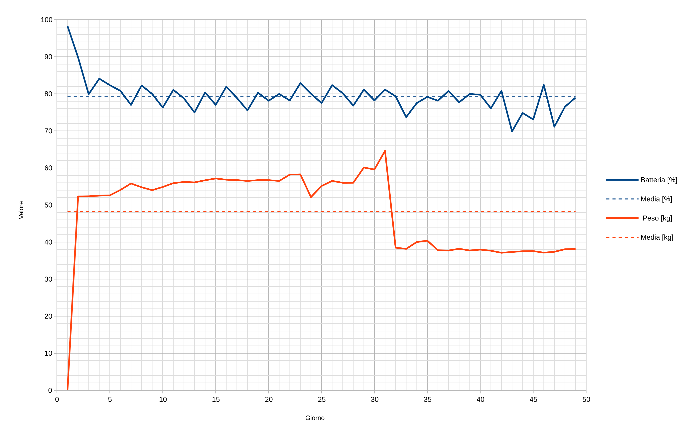

In questa cartella si trovano i dati in formato csv di batteria e peso registrati durante una prova sul campo, oltre al relativo grafico.

Come si può osservare il pannello solare è stato sufficiente per mantenere approsimativamente costante (all'80%) la carica della batteria durante l'utilizzo.

| Data    | Batteria [%] | Peso [kg] |
|---------|--------------|-----------|
| 22/7/21 | 98.31        | 0.02      |
| 23/7/21 | 89.84        | 52.32     |
| 24/7/21 | 79.89        | 52.36     |
| 25/7/21 | 84.09        | 52.54     |
| 26/7/21 | 82.34        | 52.61     |
| 27/7/21 | 80.8         | 54.07     |
| 28/7/21 | 77.02        | 55.82     |
| 29/7/21 | 82.27        | 54.79     |
| 30/7/21 | 79.96        | 54.01     |
| 31/7/21 | 76.31        | 54.87     |
| 1/8/21  | 81.08        | 55.9      |
| 2/8/21  | 78.77        | 56.22     |
| 3/8/21  | 74.98        | 56.11     |
| 4/8/21  | 80.38        | 56.68     |
| 5/8/21  | 77.02        | 57.16     |
| 6/8/21  | 81.92        | 56.83     |
| 7/8/21  | 78.91        | 56.73     |
| 8/8/21  | 75.54        | 56.5      |
| 9/8/21  | 80.31        | 56.71     |
| 10/8/21 | 78.14        | 56.71     |
| 11/8/21 | 79.96        | 56.5      |
| 12/8/21 | 78.21        | 58.2      |
| 13/8/21 | 82.9         | 58.28     |
| 14/8/21 | 80.03        | 52.13     |
| 15/8/21 | 77.51        | 55.13     |
| 16/8/21 | 82.34        | 56.51     |
| 17/8/21 | 80.17        | 56        |
| 18/8/21 | 76.81        | 56.01     |
| 19/8/21 | 81.15        | 60.12     |
| 20/8/21 | 78.21        | 59.59     |
| 21/8/21 | 81.15        | 64.61     |
| 22/8/21 | 79.33        | 38.49     |
| 23/8/21 | 73.72        | 38.17     |
| 24/8/21 | 77.51        | 40.01     |
| 25/8/21 | 79.19        | 40.37     |
| 26/8/21 | 78.14        | 37.79     |
| 27/8/21 | 80.8         | 37.72     |
| 28/8/21 | 77.72        | 38.19     |
| 29/8/21 | 79.96        | 37.73     |
| 30/8/21 | 79.75        | 37.96     |
| 31/8/21 | 76.1         | 37.67     |
| 1/9/21  | 80.8         | 37.11     |
| 2/9/21  | 69.87        | 37.33     |
| 3/9/21  | 74.84        | 37.53     |
| 4/9/21  | 73.09        | 37.57     |
| 5/9/21  | 82.41        | 37.14     |
| 6/9/21  | 71.13        | 37.38     |
| 7/9/21  | 76.52        | 38.07     |
| 8/9/21  | 78.98        | 38.14     |
